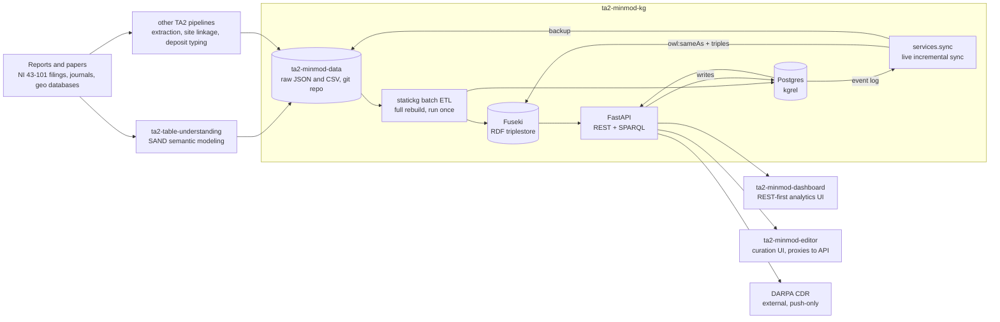
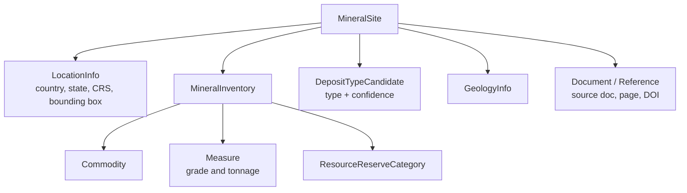

# MinMod, a field guide for new engineers

*DARPA CRITICALMAAS · TA2*

MinMod turns scattered mineral-deposit reports — NI 43-101 filings, journal papers, geological databases — into one queryable knowledge graph of mineral sites, their commodities, grades, tonnages, and deposit types. This guide walks through the six repositories that make it up, how data moves between them, and where to start reading code.

| | |
|---|---|
| **Live app** | minmod.isi.edu |
| **SPARQL endpoint** | /sparql |
| **REST API** | /api/v1 |
| **Repos in this guide** | 6 |

---

## Architecture: six repos, one graph

Everything upstream of the graph exists to turn documents into structured JSON; everything downstream exists to query and curate that graph. **ta2-minmod-kg** is the hinge — it's the only repo that touches the triplestore, and the only one the two HMI apps ultimately talk to. Reading its actual source turned up something the READMEs don't mention: the graph gets built two different ways, not one.

nginx (via **ta2-minmod-infra**) fronts all of this and isn't shown — see [ta2-minmod-infra](#ta2-minmod-infra) for the routing table. The `CDR` arrow only goes one way: MinMod pushes its deposit-type vocabulary out on a daily timer; nothing in the code pulls data back in.

### Two ways the graph gets built

The batch ETL is hand-written Python in `minmodkg/etl/`, orchestrated by `statickg` per `etl.yml` — a full rebuild you run once (`start.sh`), not a continuous poll.

Separately, every write the API makes to Postgres is appended to an event log. A long-running process, `python -m minmodkg.services.sync` (the `api_sync` container), drains that log continuously: a `KGSyncListener` pushes the corresponding triples — including the `owl:sameAs` links that make dedup real — into Fuseki within moments, while a `BackupListener` periodically commits changed records back into `ta2-minmod-data` as JSON. An editor's edit reaches the live SPARQL endpoint almost immediately, without waiting on the next full ETL run.

---

## Data model: what a mineral site actually looks like

The ontology lives in `ta2-minmod-kg/schema/ontology.ttl` under the `:` namespace (`https://minmod.isi.edu/ontology/`). A **MineralSite** is the central entity; everything else hangs off it.

Real class names from the TTL, not glosses. Also declared but not pictured: `MaterialForm`/`MaterialFormCandidate`, `MatchInfo`, and a `ThingHasLabel`/`ThingMayHaveAltLabel`/`ThingMayHaveComment` family used across entities. Every matched field — commodity, country, CRS, unit, category — has a matching `*Candidate` class (`CommodityCandidate`, `CountryCandidate`, …) that links a raw extracted string to a canonical entity with a confidence score.

**Dedup isn't part of the ontology.** There's no `same_as` property or dedup class declared anywhere in `schema/ontology.ttl` — grouping happens entirely at runtime. The live-sync process writes plain `owl:sameAs` triples between sites that resolve to the same real-world deposit, and a separate relational `DedupMineralSite` table in Postgres backs the merged view used everywhere in the dashboard and editor. Canonical vocabularies (commodities, deposit types, countries, units, CRS codes) live as controlled CSVs in `ta2-minmod-data/data/entities/` — e.g. `deposit_type.csv` has columns `minmod_id, deposit_type, deposit_environment, deposit_group` — each assigned a Q-ID in a reserved numeric range (deposit types `Q301–Q500`, countries `Q1000–Q1300`, commodities `Q501–Q700` and `Q10000–Q11000`, …).

---

## Data flow: from PDF to query result

1. **A source document arrives** — an NI 43-101 filing, a journal article, or a geological database export, usually a PDF.
2. **Tables get a semantic model** — `ta2-table-understanding` extracts tables from the PDF (Azure Document Intelligence), predicts what each column means (Graph++ via an external library, DSL, or an LLM), and its `mos_map` step exports the result as MinMod-shaped JSON — field for field, this export already matches the record shape used downstream.
3. **Structured data lands in the data repo** — that JSON, plus output from the sibling extraction/linkage/deposit-typing pipelines, is committed into `ta2-minmod-data`, grouped by contributing team. A single file typically bundles many site records, not one file per site.
4. **A batch job rebuilds the graph** — `ta2-minmod-kg`'s `statickg`-orchestrated ETL (hand-written Python services) reads that data, computes `same_as` groupings, and loads everything into Fuseki and Postgres from scratch. This runs on demand, not continuously.
5. **Edits sync back live** — between rebuilds, every write through the API lands in Postgres and is logged; `services.sync` drains that log continuously, pushing triples into Fuseki within moments and periodically backing up changed records into `ta2-minmod-data`.
6. **One API serves both stores** — FastAPI exposes REST endpoints (backed by Postgres) and a raw SPARQL endpoint (backed by Fuseki), plus JWT-gated write endpoints and a daily, push-only sync of the deposit-type vocabulary out to DARPA's CDR.
7. **Two UIs, two jobs** — `ta2-minmod-dashboard` is REST-first: it reads the API for nearly everything, reserving SPARQL for its raw query console. `ta2-minmod-editor` proxies to the same API: one native page lets curators correct and add records, while its other top-level tabs actually just embed the dashboard.

---

## Repositories

Each section covers what the repo does, its stack, the files worth reading first, and what it talks to.

### ta2-minmod-kg

**core · graph & api** — Python 3.11 · Poetry · FastAPI · statickg · Apache Jena Fuseki · PostgreSQL · Docker

The hinge of the whole system. A batch ETL and a live sync process both write into a Fuseki triplestore and a Postgres mirror; one FastAPI app reads both and exposes REST + SPARQL. Every other MinMod service ultimately reads from or writes through this repo.

**Start reading here**
- `schema/ontology.ttl` — the data model (real classes: `MineralSite`, `MineralInventory`, `ResourceReserveCategory`, `MaterialForm`, …)
- `etl.yml` + `minmodkg/etl/mineral_site.py` — the batch ETL
- `minmodkg/services/sync.py` — the live incremental sync (event log, `KGSyncListener`, `BackupListener`)
- `minmodkg/api/main.py`, `minmodkg/api/routers/mineral_site.py` — API surface
- `minmodkg/grade_tonnage_model.py` — grade & tonnage logic

**Good to know**
- Most routers mount at `/api/v1`, but `lod.router` (`/resource`, `/ontology`, `/derived`) is mounted at the site root
- `minmodkg/integrations/cdr` pushes MinMod's deposit-type list to CDR once a day by default — no pull path exists in code
- Compose service names: `kg` (image `minmod-fuseki`), `kg-postgres` (`minmod-postgres`), `api` (`minmod-backend`, port 8000)
- The Fuseki image (`containers/fuseki`) compiles its own `mytdb2` bulk-loader rather than using stock Jena tooling; `kg-postgres` ships with fixed default credentials baked into its Dockerfile
- `minmodapi/` is a separate, slimmer client library other repos import — not the server itself

### ta2-minmod-data

**data** — Plain git repo (Git LFS) · CSV / XLSX / JSON — no application code

The raw-data staging layer — input side of the ETL, nothing else. Structured as three folders under `data/`.

**Layout**
- `data/entities/` — controlled-vocabulary CSVs: units, deposit types, commodities, CRS/EPSG codes, countries, states, data sources
- `data/mineral-sites/` — JSON files grouped by contributing team (`usc`, `umn`, `sri`, `inferlink`, …) then dataset; one file commonly holds dozens of site records, not one per file
- `data/same-as/` — chunked CSVs of cross-source links; the schema isn't uniform — some sources add confidence/timestamp columns, others don't

**Good to know**
- No RDF is stored here — `ta2-minmod-kg` generates it downstream
- Each entity type reserves a Q-ID numeric range (deposit types `Q301–Q500`, countries `Q1000–Q1300`, …)
- Every matched field in a site record (commodity, country, unit, …) is stored as `{source, confidence, observed_name, normalized_uri}` — the on-disk form of the ontology's `*Candidate` pattern

### ta2-minmod-dashboard

**hmi · analytics** — Python 3.9 · Dash on Flask · Plotly · dash-ag-grid · Monaco editor · geopandas

Read-only visualization front end: KPI counts, an interactive site map, a searchable inventory table, a grade & tonnage model generator, and a raw SPARQL query console. It's REST-first, not SPARQL-first — SPARQL is used in exactly one place. Slated to merge into `ta2-minmod-editor` as a single HMI.

**Pages**
- `pages/minmod.py` — `/` KPI cards + pie charts, refreshed every 12h
- `pages/mapview.py` — `/mapview` site map, click a point to open its record
- `pages/mineralsite.py` — `/mineralsite` filterable inventory table + CSV export
- `pages/gtmodel.py` — `/gtmodel` grade & tonnage models, incl. REE/PGE groupings
- `pages/sparqlsearch.py` — `/sparqlsearch` query console

**Talks to the graph via**
- `helpers/dataservice_utils.py` — REST to `API_ENDPOINT`; every page but one goes through this, mostly `/dedup-mineral-sites`
- `helpers/sparql_utils.py` — direct SPARQL POSTs to `SPARQL_ENDPOINT`, used only by the `/sparqlsearch` console
- `models/` (`geo.py`, `gt.py`, `ms.py`) — `GeoMineral`, `GradeTonnage`, `MineralSite`; all REST, none use SPARQL

### ta2-minmod-editor

**hmi · curation** — Backend: Python, Flask (Tornado-served) · Frontend: React 18.3, Ant Design 5, gena-app (routing + data layer), mobx-react-lite

The login-gated curation UI — but only one of its five top-level routes is actually native React. `/editor` is the real curation screen; `dashboard`, `mapview`, `gradeTonnage`, and `mineralSite` are all `<IFrame>` wrappers around `ta2-minmod-dashboard`. The Flask backend has no database — `forward_request()` proxies every `/api/*` call, headers and cookies included, to the real API in `ta2-minmod-kg`.

**Start reading here**
- `minmod_editor/app.py` — `forward_request()`, the whole proxy
- `minmod_editor/__main__.py` — Tornado's `WSGIContainer` wraps the Flask app
- `www/src/models/mineralSite/MineralSiteStore.ts` — extends `gena-app`'s `CRUDStore` against `/api/v1/mineral-sites`
- `www/src/routes.tsx` — where the iframe-vs-native route split actually happens

**Good to know**
- Login is `POST /api/v1/login`; session state is a server-side cookie, checked via `GET /api/v1/whoami` — nothing is stored client-side
- Editing surfaces (in the native page): grade/tonnage, location, geology, inventory, references, dedup grouping, new-site creation

### ta2-minmod-infra

**deployment** — Python (`mms` package) · Docker Compose · nginx

No application code — this is the orchestrator. It clones the other MinMod repos, builds their images, generates config/certs/env files, and fronts everything with nginx as reverse proxy and TLS terminator. Its own `docker-compose.yml` doesn't define Fuseki or Postgres at all — those come from `ta2-minmod-kg`'s own compose file, built as a side effect of the same build step.

**`mms/build.py` functions**
- `update_repo()` clones/pulls 5 repos into `main/` — dashboard, kg, data (Git LFS), `ta2-minmod-data-sample` (from a personal GitHub, not DARPA-CRITICALMAAS), editor
- `install_certs()` / `install_config()` generate a self-signed TLS cert and `config.yml`, only if missing
- `process_env_file()` + `validate_envfile()` diff every repo's `env.template` against local `.env` and hard-fail the build until every placeholder comment is resolved
- `build_repo()` runs `docker compose build` in each sub-repo, then at the infra root

**nginx routes (verbatim)**
- `/` → `editor:9000`
- `/dashboard`, `/dashboard/` → `dashboard:8050`
- `/sparql`, `/sparql/` → `kg:3030/minmod/sparql`
- `/api`, `/resource`, `/ontology`, `/derived` → `api:8000`

`mms/update.py`'s `build_kg()` mounts the Docker socket into the `minmod-backend` image and runs `python -m statickg etl.yml <kgdata> <data> --overwrite-config --no-loop` — the actual full-rebuild trigger.

### ta2-table-understanding

**ingestion** — Python · Ray · SAND · Azure Document Intelligence

Turns tables inside PDFs into semantic models, then exports MinMod-shaped JSON — this is the step that produces the site records that eventually land in `ta2-minmod-data`.

**Pipeline (`tum/dag.py`)**
- `table` → `sem_label` (`GppSemLabelActor` / `DSLSemLabelModel`) → `sem_model` → `export`
- `sem_model` runs `TumGppSemModelAlgo` (`tum/sm/gpp/main.py`), which delegates candidate-graph/Steiner-tree work to an external `gpp` (gramsplusplus) package, plus optional SAND curation
- `export` runs `DReprActor` → TTL, then `mos_map` (`tum/map_mos.py`) → MinMod JSON

**Good to know**
- `MNDRDB` (`tum/db.py`) is RocksDB-backed, parsing `schema/mos.ttl` via `rdflib` into entities/classes/props stores
- The `mos_map` JSON export's fields (`record_id`, `location_info`, `deposit_type_candidate`, `mineral_inventory`, `reference`, …) match `ta2-minmod-data`'s real record shape almost exactly — confirmed by reading both
- The SAND UI's export button (`tum/integrations/sand/_minmod_json_export.py`, class `MinModJSONExport`) builds TTL then runs it through the same `MosMapping` class as the batch `mos_map` step — manual and automated exports produce the same JSON shape
- Needs `MINMOD_DIR` pointing at a folder containing this repo alongside `ta2-minmod-data` and `ta2-minmod-kg`; the containerized SAND UI (`containers/sand`) instead clones pinned commits of both via build args and builds separate curation databases for the `minmod` and `geochem` projects

---

## Running it locally

The fastest path to a full working stack is `ta2-minmod-infra`, which provisions everything else for you:

1. **Clone infra and bootstrap** — `git clone ta2-minmod-infra && cd ta2-minmod-infra && python -m venv .venv && pip install -e .`, then `python -m mms.build`. First run will stop and ask you to fill in `config.yml` (a secret key) and any missing values in `.env`.
2. **Re-run the build** — `python -m mms.build` again — this time it clones `ta2-minmod-kg`, `ta2-minmod-data`, `ta2-minmod-dashboard`, `ta2-minmod-editor` into `main/` and builds every Docker image.
3. **Bring the stack up** — `docker compose up` at the infra root starts nginx, the API, dashboard, and editor; Fuseki and Postgres are defined in `main/ta2-minmod-kg`'s own `docker-compose.yml` (built by the same step) and need to be brought up there too, all sharing the external `minmod` Docker network.
4. **Populate the graph** — `python -m mms.update` runs the `statickg` ETL against `main/ta2-minmod-data` to load the triplestore and Postgres for the first time.

Working on a single piece instead? Each app repo's own README has a standalone path — e.g. `ta2-minmod-dashboard` just needs `API_ENDPOINT`/`SPARQL_ENDPOINT` pointed at a running API (your local one, or `minmod.isi.edu`), and `ta2-minmod-editor`'s frontend just needs `MINMOD_API` pointed the same way.

---

## Glossary

| Term | Meaning |
|---|---|
| **RDF / triple** | The subject–predicate–object format the knowledge graph is stored in — every fact is one triple, e.g. *this site* — *hasCommodity* — *copper*. |
| **Fuseki** | Apache Jena's triplestore — the database that holds the RDF graph and answers SPARQL queries. MinMod's triplestore backend. |
| **SPARQL** | The query language for RDF graphs — think SQL, but for triples. Exposed directly at `/sparql` and used by the dashboard's query console. |
| **D-REPR** | A declarative mapping language used by `ta2-table-understanding`'s `DReprActor` to turn semantic models into TTL. |
| **statickg** | The ETL orchestration framework that runs `ta2-minmod-kg`'s batch pipeline once per full rebuild, loading results into Fuseki and Postgres. |
| **Dedup / same_as** | Multiple source records describing the same real-world deposit get linked by runtime `owl:sameAs` triples (written by the live-sync process, not declared in the ontology) plus a relational `DedupMineralSite` table, merged into one "dedup mineral site" for display. |
| **CDR** | DARPA's Critical Data Repository. MinMod pushes its deposit-type vocabulary to it once a day by default — no code path pulls data back from CDR into MinMod. |
| **Grade & tonnage model** | A standard mining-industry summary (ore grade vs. total tonnage) computed per commodity/deposit-type from the inventory data — `minmodkg/grade_tonnage_model.py`, visualized in the dashboard's `/gtmodel`. |

---

*Built by reading source code directly across all six repos under `~/Github/DARPACRITICALMAAS` — routers, store classes, docker-compose files, nginx config, ontology TTL, ETL scripts — rather than relying on their READMEs (or, for `ta2-table-understanding`, its CLAUDE.md).*
